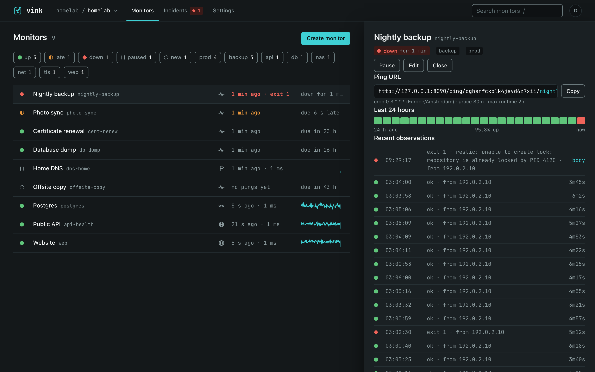
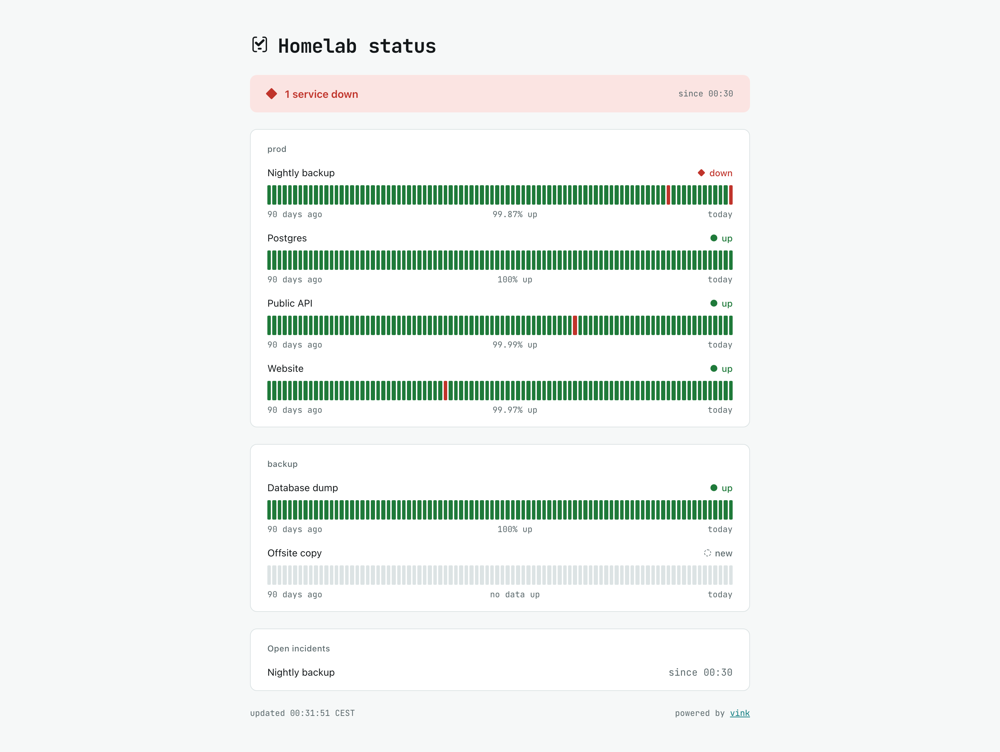
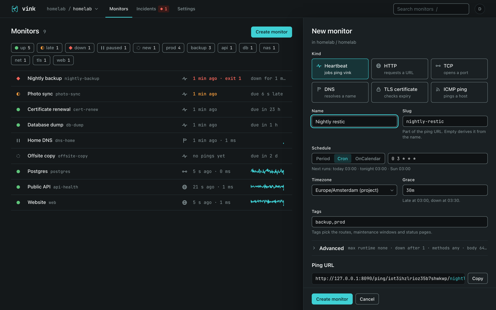
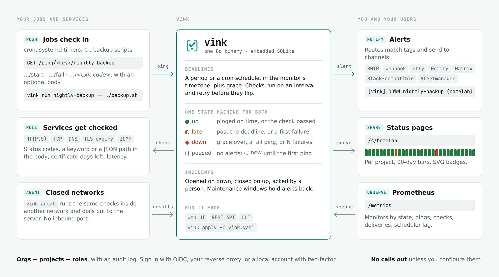
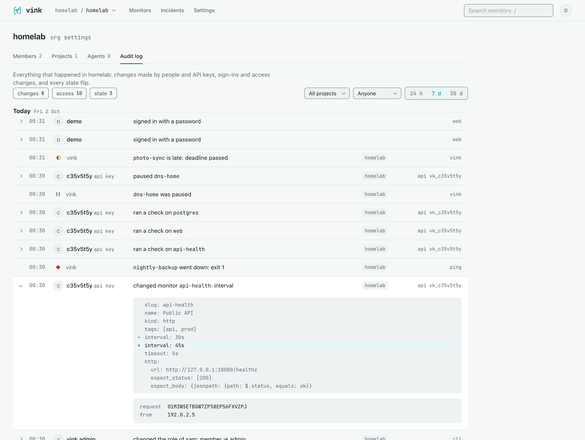

<p align="center"></p>

[](https://github.com/w4jnl/vink/actions/workflows/ci.yml)

vink tells you when a cron job does not check in or a service stops answering. One Go binary
with SQLite, and nothing leaves your network unless you configure it.

Jobs ping a URL when they run, as with Healthchecks; vink checks HTTP, TCP, DNS, TLS and ICMP
targets on an interval, as Uptime Kuma does. Both feed one state machine, one incident list, one
set of alert routes and public status pages, behind a web UI, a REST API and a CLI.

<p align="center"></p>

<p align="center">


</p>

<p align="center"></p>

## Setup

Current version: 0.1.0 · [release notes](CHANGELOG.md). Linux and macOS on amd64 and
arm64 run the server, the agent and the CLI; the Windows build is for the CLI and the agent.

1. Run it. With Docker, on a named volume for `/data`:
   ```sh
   docker run -d --name vink -p 8080:8080 -v vink-data:/data ghcr.io/w4jnl/vink
   ```
   Or with a release binary from the [releases page](https://github.com/w4jnl/vink/releases):
   ```sh
   ver=0.1.0; os=$(uname -s | tr '[:upper:]' '[:lower:]'); arch=$(uname -m | sed 's/x86_64/amd64/; s/aarch64/arm64/')
   curl -fsSLO "https://github.com/w4jnl/vink/releases/download/v$ver/vink_${ver}_${os}_${arch}.tar.gz"
   curl -fsSLO "https://github.com/w4jnl/vink/releases/download/v$ver/sha256sums.txt"
   sha256sum -c --ignore-missing sha256sums.txt
   tar -xzf "vink_${ver}_${os}_${arch}.tar.gz" vink && sudo install vink /usr/local/bin/
   vink serve        # listens on :8080, writes vink.db and secret.key in the working directory
   ```
2. Bootstrap. This creates the instance admin, the first org and its first project, and prints
   the project's ping key and a read-write API key, once:
   ```sh
   printf 'a-long-password\n' | docker exec -i vink /vink admin init --org homelab --user admin --password-stdin
   # binary: printf 'a-long-password\n' | vink admin init --org homelab --user admin --password-stdin
   ```
   It runs against the database file, beside the running server or before it.
3. Open http://localhost:8080 and sign in. Point the CLI at the server with the API key:
   ```sh
   vink ctx add homelab --server http://localhost:8080 --key vk_…
   ```
4. Create a heartbeat in the UI (Create monitor, kind Heartbeat, schedule `0 3 * * *`, grace
   `30m`), then ping it from the job's crontab line:
   ```cron
   0 3 * * * /usr/local/bin/backup.sh && curl -fsS -m 10 --retry 3 http://localhost:8080/ping/<ping key>/nightly-backup
   ```
   Where the CLI is installed, `vink run nightly-backup -- /usr/local/bin/backup.sh` does the
   same and also reports a failure with its exit code and the output.
5. Add a channel so the first `down` reaches you. The first channel of a project gets a route
   that sends every down and up; an ntfy topic needs three lines in `vink.yaml`:
   ```yaml
   version: 1
   channels:
     - {name: phone, kind: ntfy, url: https://ntfy.example.com, topic: vink}
   ```
   ```sh
   vink apply -f vink.yaml
   ```

`vink status` prints the counts per state and exits 3 while anything is down, so it doubles as
a check of the install.

### More install options

- Homebrew, on macOS or Linux: `brew install w4jnl/tap/vink`.
- Release binaries for Linux and macOS on amd64 and arm64, Windows on amd64 for the CLI and
  the agent, each with `sha256sums.txt` and an SBOM; the image `ghcr.io/w4jnl/vink` for amd64
  and arm64, built `FROM scratch` with the binary and CA certificates.
- `docs/deploy/vink.service` is a hardened systemd unit (`DynamicUser`, `StateDirectory=vink`),
  `vink-agent.service` the agent's, `compose.yaml` a one-container compose file.
- Behind Traefik with Authelia or Apache with Kerberos: `docs/deploy/traefik-authelia.yaml` and
  `docs/deploy/apache-kerberos.conf` show the headers, the shared secret and the paths that stay
  open.
- From source, with Go 1.27 or newer and no cgo: `make build` writes `./bin/vink`.

## Why vink

The problem:

- A job that does not run makes no noise. A backup that stopped in March is found in July.
- Heartbeat tools and uptime tools are separate products, with separate users, alerts and
  status pages.
- Self-hosted monitors are mostly single-user, and hosted ones cannot see inside a closed
  network.

What vink does about it:

- One state machine for push and pull: cron-aware deadlines with a timezone and a grace, retries
  before a check flips, and the same incidents, routes and status pages for both.
- Orgs, projects and roles from the first migration. Sign-in is through OpenID Connect, the
  reverse proxy you already run, or local accounts with two-factor, and every change lands in an
  audit log.
- One binary with SQLite, agents that dial out from networks the server cannot reach, and no
  outbound connection unless configured.
- `vink.yaml` with `apply` and `export`, so monitors, channels and routes live in git.

Compared with:

- [Healthchecks](https://healthchecks.io) is the reference for heartbeats; vink borrows its URL
  forms and signals. It has no pull checks, by design.
- [Uptime Kuma](https://github.com/louislam/uptime-kuma) has many check types, push monitors on a
  fixed interval, and a single user.
- [Gatus](https://github.com/TwiN/gatus) is configured from a file and has no user model.

When not to use vink: on-call paging with schedules and escalation (route vink to an incident
manager instead), browser checks that drive a page, or probes from many internet regions (a
hosted synthetic monitor).

## Features

- **Heartbeats**: a period or a 5-field cron schedule in the monitor's timezone, a tolerance
  and a grace, a maximum runtime, `start`, `fail`, `log` and exit-code signals, run ids that pair a start with
  its finish, the body of a ping stored up to 64 kB, `?create=1` to make a monitor from its first
  ping, `vink run` to wrap a command and `vink ping` for scripts, with the ping key alone, and
  clients for programs: a Go module, [`github.com/w4jnl/vink/ping`](ping/README.md), and a Python
  package, [`vink_ping`](ping-py/README.md), both without dependencies.
- **Checks**: HTTP with status, keyword and JSON path assertions, redirects and a private CA; TCP
  with a banner; DNS; TLS expiry; ICMP. Each on an interval from 10 s with a timeout, confirm
  retries, failure and recovery thresholds, latency sparklines, `check now`.
- **History**: a drawer with the last day's bar, observations and state changes for every
  monitor, and a full page behind it with the whole timeline grouped by day, filtered by
  outcome and period, loading older rows as you scroll.
- **Any screen**: one stylesheet, no build step, and the same pages on a phone, a tablet and a
  wide monitor; the drawer becomes the page where there is no room beside the list.
- **Alerts**: routes match tags and send `down`, `up` and `late` to SMTP, webhooks with Go
  templates, ntfy, Gotify, Matrix, Slack-compatible hooks and Alertmanager; repeats while an
  incident stays unacknowledged; six delivery attempts with backoff; one-click acknowledgement
  links; a Test button per channel; maintenance windows, one-off and weekly.
- **Status pages**: per project, or per org across its projects, at `/s/<slug>`, grouped by tag
  or by project, 90-day bars, open incidents and optionally those of the last 7, 30 or 90 days, an
  optional password, a custom domain, SVG and JSON badges, cacheable for 30 s and free of scripts.
- **Teams and sign-in**: orgs, projects and the roles viewer, member, admin and owner; invites
  by one-time link; monitor and agent quotas per org; an instance admin page; local accounts with
  TOTP and recovery codes; trusted proxy headers; OpenID Connect with PKCE; groups mapped to
  roles; an audit log per org and for the instance with the before and after of every change.
- **Config as code**: `vink apply` and `vink export` for a project or a whole org, a JSON Schema
  for the file, a diff, a dry run and a prune; importers for Healthchecks and Uptime Kuma.
- **Operations**: one binary and one SQLite file, `vink admin backup` while running, 90 days of
  observations and 14 days of bodies kept, Prometheus `/metrics`, `/healthz` and `/readyz`, an
  outbound proxy and CA bundle, an egress log, agents over an outbound WebSocket, shell
  completion.

## Scope and status

vink is a personal tool, published because the approach may be useful to others. It runs my
homelab and is built to install in closed corporate networks, which sets its priorities:
features are the ones those two places need, and support is best effort.

Not yet:

- A Postgres backend behind the store interface.
- A Terraform provider generated from the API.
- OTLP traces.

Not planned:

- On-call schedules, escalation or paging people directly.
- Log, metric or trace storage, or dashboards beyond the monitor list and detail.
- Browser checks, SMS or voice delivery, billing.
- A JavaScript single-page app; the UI is server-rendered with htmx partials.

vink is at 0.1.0 (2026-10-02). [`CHANGELOG.md`](CHANGELOG.md) lists what changed in every
release, newest first; the same text is on each GitHub release.

## How it works

<picture>
  <source media="(prefers-color-scheme: dark)" srcset="assets/readme/how-it-works-dark.png">
  
</picture>

### States

| State | Glyph | Enters when | Leaves when |
| --- | --- | --- | --- |
| new | ◌ | the monitor is created | the first ping or check |
| up | ● | a ping arrives on time, or a check passes | the deadline plus the tolerance passes, or a check fails |
| late | ◐ | a heartbeat misses its deadline by more than the tolerance (30 s by default), or a check fails but is not yet confirmed | a ping arrives, the grace runs out, or the failures reach the threshold |
| down | ◆ | the grace is over, a fail ping or exit code arrives, or the failures reach the threshold | an ok ping or passing check; an incident opens on entry and closes on exit |
| paused | ‖ | pause, by hand or from the API | resume |

Every state has a word and a glyph, so colour is never the only signal. Every flip writes an
event; a monitor inside an active maintenance window records observations but never enters
`down` and never alerts.

### Ping URLs and signals

| URL | Meaning |
| --- | --- |
| `/ping/<key>/<slug>` | ok; GET, POST, HEAD or PUT; a body up to 64 kB is stored |
| `/ping/<key>/<slug>/start` | the job started; `?rid=` pairs it with the finishing ping |
| `/ping/<key>/<slug>/fail` | the job failed |
| `/ping/<key>/<slug>/<exit code>` | 0 is ok, anything else is a fail with the code stored |
| `/ping/<key>/<slug>/log` | store a message without touching the state |
| `/ping/id/<monitor id>` | the same forms by id |

`?create=1` creates an unknown slug as a heartbeat with a one-day period and a one-hour grace.
`?msg=` stores a short message for clients that cannot send a body. Unknown keys and slugs get
the same 404. Pings are limited to 10 a minute per monitor and 300 a minute per address, and the
ping key is an address, not a secret: rotate it from the project's keys tab when it leaks.
[`docs/heartbeats.md`](docs/heartbeats.md) is the guide for the person writing the job: runs
with start and finish, progress notes, bodies and messages, scripting with `vink run` and
`vink ping`, the Go and Python clients, and recipes for cron, systemd, CI, Python and PowerShell.

### Check kinds

| Kind | Main fields | Up when |
| --- | --- | --- |
| `http` | `url`, `method`, `headers`, `body`, `expect_status`, `expect_body` (`contains`, `not_contains` or `jsonpath`), `follow_redirects`, `verify_tls`, `ca_pem` | the status is expected and the body matches |
| `tcp` | `host`, `port`, `send`, `expect` | the port accepts and the banner contains `expect` |
| `dns` | `name`, `type`, `resolver`, `expect` | the name resolves and every expected answer is present |
| `tls` | `host`, `port`, `servername`, `warn_days`, `crit_days` | the handshake verifies; `late` inside `warn_days`, `down` inside `crit_days` |
| `icmp` | `host`, `count`, `loss_threshold` | fewer packets are lost than the threshold; needs `CAP_NET_RAW` or `net.ipv4.ping_group_range` on Linux |

Every kind takes `interval` (10 s or more; 30 s through an agent), `timeout`, `confirm`
(`retries` and `delay` before a failure counts), `failure_threshold` and `recovery_threshold`.

### Alerts

A route matches monitors by tags (all of the route's tags; none matches every monitor) and sends
the events in its `on` list to its channels, with an optional `repeat_every` while the incident
stays unacknowledged. Channels are `smtp`, `webhook` (a Go template over the notification;
`docs/webhook-templates/` has PagerDuty, Opsgenie, Discord and Telegram), `ntfy`, `gotify`,
`matrix`, `slackhook` and `alertmanager`. Deliveries go through an outbox: six attempts at 30 s,
2 min, 10 min, 30 min and 2 h, in order per monitor. A `down` caused by a ping carries the
ping's message (`?msg=` or the tail of its body) and exit code, so the alert says why. Every
notification carries a signed acknowledgement link that works for seven days without a sign-in. Maintenance windows, one-off
or weekly with a timezone, hold alerts back for the monitors that carry their tags.

### Status pages and badges

A status page shows the monitors that carry any of its tags, grouped by tag, each with a state
and a 90-day bar built from its events, plus open incidents. A project's members make pages in
its settings. An org's admins make pages in org settings that span the org's projects, all of
them or a chosen few, one box per project or grouped by tag across them. Any page can also list
the incidents resolved in the last 7, 30 or 90 days, showing the monitor, when it started and how
long it lasted, never the reason. It ships no script, is cacheable for 30 s, can ask for a
password, and can be served on its own domain routed to vink. Badges live at
`/s/<slug>/badge/<monitor>.svg` and `.json` (Shields schema), or
`/s/<slug>/badge/<project>/<monitor>.svg` on an org page where two projects share a slug.

### Agents

A probe agent runs pull checks from a network the server cannot reach. It is the same binary:
`vink agent --server wss://vink.example.com --token vat_…` dials out over WebSocket, announces its
labels, runs the checks it is given with the server's own checkers, and keeps nothing on disk. A
monitor names its agent or a label set; the least loaded agent with those labels runs it. An
agent quiet for two minutes turns its monitors late with the reason "agent offline"; they never
go down for lack of an agent.

### Tenancy and sign-in

<p align="center"></p>

- Orgs hold projects; a membership gives one of four roles in every project of the org: viewer
  (read), member (edit monitors, channels, routes, maintenance and pages, acknowledge, see the
  ping key, make read-only API keys), admin (rotate the ping key, read-write keys, projects,
  members, agents) and owner (transfer or delete the org). Instance admins see every org and set
  quotas. A request for another tenant's resource is a 404.
- Invites are one-time links that expire after seven days and create a local account with its
  membership; owners invite owners.
- Local accounts: argon2id passwords, sessions you can list and sign out, TOTP from an
  authenticator app set up from a QR code the server draws, ten recovery codes shown once.
  `auth.local.totp = "required"` makes everyone set it up first. Instance admins hand out
  one-time password reset links; vink sends no mail.
- Proxy mode trusts identity headers only from `trusted_cidrs` with the shared secret header;
  `docs/deploy/traefik-authelia.yaml` shows the Authelia side.
- OpenID Connect uses the authorization-code flow with PKCE, checks the state and the nonce, and
  maps the groups claim to roles the same way proxy mode maps a header: a group `vink:<org>:<role>`
  grants that role, `vink:admin` makes an instance admin.
- The audit log per org lists changes with the YAML before and after, access events and every
  state flip, filtered by kind, project, person and period; members see their projects' rows.
  Instance admins have the whole instance at `/admin/audit`. Rows are never edited or pruned.

### Data and backups

Everything is in one SQLite file (`db.path`, `/data/vink.db` in the image, `/var/lib/vink/vink.db`
with the systemd unit) plus `secret.key` next to it, which encrypts channel and two-factor
secrets and signs links. `vink admin backup --out vink-backup.db` writes a consistent copy while
the server runs; copy the key file with it. Observations are pruned after 90 days and stored
bodies after 14; events, incidents and the audit log are kept.

## CLI

`vink` is one binary: `serve` runs the server, `agent` runs a probe, `admin` works on the
database file on the server host, and the rest talk to a server through a context, like kubectl.

| Command | What it does |
| --- | --- |
| `vink serve` | runs the server: migrations, scheduler, dispatcher and HTTP; `--print-config` shows the effective config |
| `vink agent --server … --token …` | runs a probe agent that connects out to the server |
| `vink admin init --org <slug> --user <name> --password-stdin` | bootstraps an empty database: instance admin, first org, first project, rw API key |
| `vink admin org create\|ls` · `org key create\|ls\|revoke` | orgs and org keys (export and apply for a whole org) |
| `vink admin user ls\|create\|promote\|grant\|revoke\|totp-reset\|reset-link` | users, roles in an org, and the break-glass for a lost phone or password |
| `vink admin agent add\|ls\|revoke` | an org's probe agents |
| `vink admin backup --out <file>` | a consistent copy of the database with VACUUM INTO |
| `vink migrate up\|down\|status\|new\|dump` | migrations; `dump` writes `db/schema.sql` |
| `vink ctx add\|use\|rm\|ls` | contexts: a server URL plus an API key |
| `vink ls [--tag] [--state]` · `get <slug>` · `logs <slug> [-n] [--follow]` | monitors, one monitor with its last ten events, observations |
| `vink pause\|resume\|check <slug>` · `ack <incident id>` | actions |
| `vink ping <slug> [--start] [--fail] [--exit N] [--log] [--msg …]` | a ping with the project's ping key: `VINK_PING_KEY` and `VINK_PING_URL` on a job host, no API key needed, or looked up through the context's read-write key |
| `vink run <slug> -- <command…>` | a start ping, the command, a finish ping with its exit code and output tail; finds the ping key as `vink ping` does |
| `vink status` | counts per state and open incidents; exits 3 while anything is down |
| `vink apply -f <file> [--dry-run] [--prune]` · `export [-o] [--org]` | declarative configuration, with the diff |
| `vink import healthchecks\|kuma -f <file> [--apply]` | converts another monitor's export into an apply file |
| `vink completion bash\|zsh\|fish\|powershell` | shell completion; monitor slugs, incidents, tags and contexts complete from the server |
| `vink version` | build version, commit and Go version |

`--json` is on every read command; `-d` turns on debug logging with colour.

## API

`/api/v1/`, documented by `/api/v1/openapi.yaml`. `Authorization: Bearer <api key>` scopes a
request to the key's project; `ro` keys get 403 on anything but GET. A browser session may call
the API too, scoped by its org and project and the person's role. Errors are RFC 7807 problem
documents whose `type` links to [`docs/errors.md`](docs/errors.md). `PUT /api/v1/apply` takes the
same file as `vink apply`; [`docs/apply-schema.json`](docs/apply-schema.json) is its schema.

## Configuration

[`docs/vink.example.toml`](docs/vink.example.toml) lists every key with its default and a line on
what it does. Each key is also an environment variable, `VINK_<SECTION>_<KEY>`, and the
environment wins over the file. `vink serve --config vink.toml`, or `VINK_CONFIG_FILE` for every
command; `vink serve --print-config` shows the effective configuration with secrets redacted.

## Deployment

[`docs/deploy.md`](docs/deploy.md) is the deployment guide: the address (an own hostname, or a
path on a shared host such as `https://www.example.com/vink`, set through `base_url`), the proxy
rules and the paths that stay open, a verification checklist, a troubleshooting table and the map
of every URL vink serves. `docs/deploy/` holds the systemd units for the server and the agent, the
compose file, the Traefik with Authelia, Apache with Kerberos and nginx snippets, and
`vink.toml.example`. The image has no shell: `docker exec -i vink /vink admin …` runs admin commands, and health is checked from
outside at `/readyz`. ICMP monitors need `CAP_NET_RAW` in the container or
`net.ipv4.ping_group_range` on the host. For an air-gapped install, set `[outbound] egress_log`
to a file: it records every connection the server opens, and an idle install leaves it empty.

## Security

Ping keys are addresses, not secrets, and the ingress is rate-limited. Proxy headers are trusted
only from `trusted_cidrs` with the shared secret. Outbound checks and webhooks can be kept off
private addresses with `allow_private_targets = false`. Channel and two-factor secrets are
encrypted under `secret.key`; passwords, API keys, agent tokens and recovery codes are stored
hashed. Every UI response carries a Content Security Policy without inline scripts. Report a
vulnerability privately; [`SECURITY.md`](SECURITY.md) has the surface, the policy and three lines
of deployment advice.

## Troubleshooting

`vink serve -d` logs every request with its id, org, project and user, every state flip with its
reason, every delivery attempt with the response, scheduler ticks that fell behind, and why a
proxy identity or an OIDC callback was refused. `/readyz` fails when the database cannot be
written within 2 s or the scheduler has not ticked for 30 s. The Server tab of the instance
admin page shows the running configuration and warns when `vink admin backup` has not run for a
day.

## Development

```sh
make tools       # pinned sqlc, golangci-lint, air, goreleaser and govulncheck into ./bin
make dev         # live reload of vink serve -d on data/vink.db
make generate    # sqlc
make migrate     # apply migrations and dump db/schema.sql
make lint        # gofmt, vet, golangci-lint, the tenancy gate and the egress gate, for both modules
make test        # go test -race ./... for both Go modules, and the Python client's tests
make e2e         # four smoke tests against the built binary, about six minutes
make golden      # regenerate the UI golden files from the design system with node
```

`cmd/vink` is the cobra root; `internal/` holds the service layer, the engine, the checkers, the
notifiers, the HTTP transports and the sqlc store; `e2e/` the smoke tests; `ping/` the Go client
module, a module of its own with no dependencies; `ping-py/` the Python client. `docs/design.md` is
the design vink is built from, `docs/design-system/` the brand and UI rules the templates follow
(the markup is what `components/bundle.js` returns), and `CLAUDE.md` the conventions. Every
project-scoped query filters by `project_id`; `internal/http/crosstenant_test.go` checks every
route across the boundary.

## Credits and licence

vink is MIT licensed (see `LICENSE`).

The UI vendors [htmx](https://htmx.org) 4.0.0 (Zero-Clause BSD, `internal/http/web/static/htmx-LICENSE.txt`)
and embeds [JetBrains Mono](https://github.com/JetBrains/JetBrainsMono) (SIL Open Font License
1.1, `OFL.txt` next to the font files). The server uses [modernc.org/sqlite](https://gitlab.com/cznic/sqlite)
(BSD-3-Clause), [cobra](https://github.com/spf13/cobra) (Apache-2.0),
[go-oidc](https://github.com/coreos/go-oidc) (Apache-2.0), [gronx](https://github.com/adhocore/gronx)
(MIT) and [go-qrcode](https://github.com/skip2/go-qrcode) (MIT); `go-licenses report ./...` lists
the rest. The name is Dutch: a *vink* is a finch, and a *vinkje* is the tick on a list.
