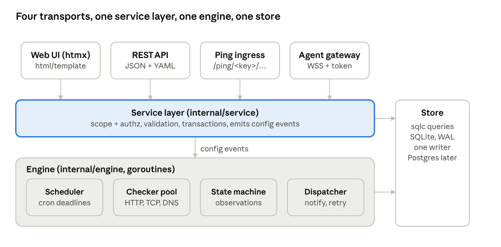
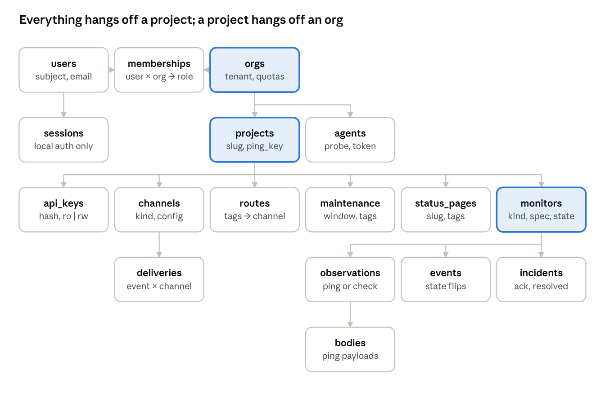
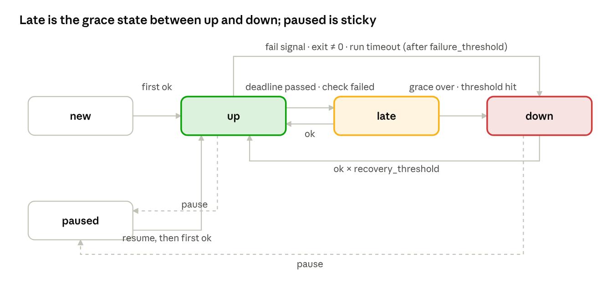
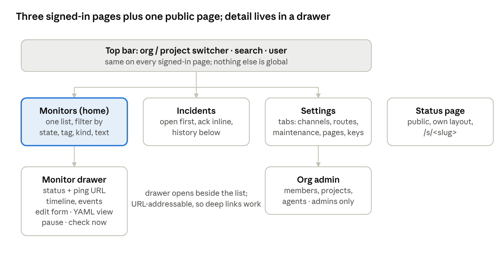
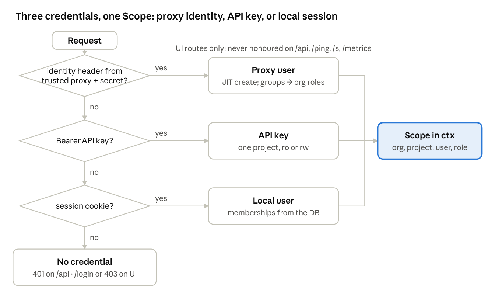

# vink — design document

As of 2026-09-27 · J. This file is the source of truth for implementation. Brand and UI rules: `docs/design-system/`; logos and icons: `assets/brand/`.

## Purpose, scope and principles

This document specifies a self-hosted status monitor — heartbeat receivers plus active pull checks, multi-tenant from the first migration, one Go binary with embedded SQLite — in enough detail for an implementing agent to build phases 0 and 1 without further design decisions. Background and competitor analysis are in [Monitoring Landscape & Build Assessment](https://claude.ai/code/artifact/d325cfae-5dc8-4dd2-a109-07abad5791ea). Name: `vink` (binary and CLI), github.com/w4jnl/vink.

**Goals (v1)**

- Heartbeat monitors: simple period or cron schedule, per-monitor timezone, grace, `start` / success / `fail` / `log` / exit-code signals, run IDs, body capture.
- Pull checks: HTTP(S) with status, keyword and JSON-path assertions; TCP; DNS; TLS expiry; ICMP.
- One state machine for both kinds, incidents, maintenance windows, tolerance rules.
- Organisations → projects → roles; per-project API keys and ping keys; no account-wide keys.
- Three interfaces over one service layer: web UI (server-rendered + htmx), CLI, REST API. Declarative `apply` of a YAML file through API and CLI.
- Notifiers that work offline first: SMTP, generic webhook, ntfy, Gotify, Matrix, Slack-compatible webhook (Mattermost, Rocket.Chat), Alertmanager receiver.
- Public status pages per project, SVG badges, Prometheus metrics.
- Auth by trusted reverse-proxy headers (Authelia, Apache + Kerberos, oauth2-proxy) or local accounts; OIDC native later.
- Probe agents for closed networks (phase 2): same binary, outbound-only.
- No outbound network calls unless configured; no telemetry, update check or CDN assets.

**Non-goals**

- On-call schedules, escalation, paging people directly (webhook out to PagerDuty, Alertmanager, etc.).
- Log, metric or trace storage; dashboards beyond the monitor list and detail.
- Browser (Playwright) checks, SMS or voice delivery, billing.
- A JavaScript SPA; the UI is server-rendered with htmx partials.

**House conventions the agent must follow**

| Concern | Choice |
| --- | --- |
| Language | Go 1.23+, stdlib first, `internal/` packages, no global state, `context.Context` on every I/O path |
| Logging | `log/slog`, JSON handler by default; -d / --debug on any command sets debug level and switches to a colourised text handler (MatusOllah/slogcolor; Prefix per subsystem, SrcFileMode short in debug, NoColor set from TTY detection and NO\_COLOR); every request log carries `req_id`, `org_id`, `project_id`, `user` when known |
| HTTP | `net/http` ServeMux with method patterns (`GET /p/{project}/m/{slug}`), middleware as `func(http.Handler) http.Handler` |
| Database | SQLite via `modernc.org/sqlite` (pure Go, static binary), WAL mode, one writer; all queries through `sqlc`, hand-written SQL in `internal/db/queries/*.sql` |
| Migrations | Embedded SQL files, `amacneil/dbmate` v2 as a library: timestamped files with -- migrate:up / -- migrate:down sections, embedded, applied at startup; dbmate dumps db/schema.sql, which is sqlc's schema input |
| Templates | `html/template` compiled once, embedded with `embed.FS`; htmx 2.x vendored; one hand-written CSS file with design tokens |
| CLI | `spf13/cobra` subcommands, `--json` on every read command |
| Config | TOML file + `VINK_*` env overrides, `koanf` or hand-rolled; secrets never logged |
| Errors | wrap with `%w`, sentinel errors per package, HTTP errors as RFC 7807 `application/problem+json` |
| Dev loop | `air` for live reload, make migrate runs dbmate up + dump, `go generate` runs `sqlc`, `make lint` runs `golangci-lint`, `make test` |
| Tests | table-driven, `testing` + `httptest`, temp SQLite per test, no mocks of the DB |

**Principles**

1. Tenancy is structural: every table row has `project_id` (and `org_id` where projects are absent); every sqlc query takes a scope; there is no query that lists across projects except for org admins.
2. One state machine: pings, local results and agent results are the same `Observation` type.
3. Simple surface, flexible core: the UI shows one list and one detail per entity with progressive disclosure; everything the UI cannot express is reachable through YAML `apply` and the API.
4. Boring, static, offline: one process, one file on disk, no runtime dependencies, deterministic builds.

## Architecture and repository layout

One process, four transports that never touch the database directly, a service layer that owns authorization and transactions, an engine of long-lived goroutines, and a store generated by sqlc.



The CLI is a client of the REST API and shares no code with the server except the domain types and the YAML apply schema. The ping ingress and agent gateway call the service layer's `Observe` path, which validates the key and hands an `Observation` to the state machine.

```
cmd/vink/                  cobra root; subcommands: serve, agent, migrate, admin, ctx, apply, get, ls, ping, status, export, import
internal/config/          TOML + VINK_* env, validation, redaction for logs
internal/domain/          Monitor, Spec (per kind), Observation, State, Event, Incident, Scope, Role, ids
internal/db/              db.go (open, pragmas, WAL, busy_timeout), generated sqlc code
internal/db/migrations/   YYYYMMDDHHMMSS_name.sql (-- migrate:up / down), embedded, dbmate library; schema.sql dumped for sqlc
internal/db/queries/      *.sql grouped by table; every query takes project_id (or org_id)
internal/service/         orgs.go projects.go monitors.go keys.go channels.go pages.go maintenance.go apply.go observe.go
internal/engine/          scheduler.go statemachine.go dispatcher.go bus.go (in-process, typed channels)
internal/checks/          checker.go (interface, registry) http.go tcp.go dns.go tls.go icmp.go
internal/schedule/        period + cron next-due, timezone handling, DST table tests
internal/notify/          notifier.go (interface) smtp.go webhook.go ntfy.go gotify.go matrix.go slackhook.go alertmanager.go
internal/auth/            proxyheader.go local.go session.go apikey.go pingkey.go roles.go middleware.go
internal/http/            server.go router.go middleware/ (reqid, log, recover, csrf, scope)
internal/http/web/        page handlers, templates/ (layout, pages, partials), static/ (css, htmx.min.js)
internal/http/api/        v1 handlers, problem.go, pagination.go, openapi.yaml served at /api/v1/openapi.yaml
internal/http/ping/       ingress handlers, rate limit, body capture
internal/http/agentgw/    WebSocket gateway, assignment, result intake
internal/agent/           agent runtime: connect, run checks, report, reconnect
internal/cli/             REST client, contexts (~/.config/vink/config.toml), table/json printers
internal/metrics/         Prometheus collectors
docs/                     apply-schema.json, deploy/ (systemd, nomad, compose, traefik-authelia, apache-kerberos)
```

**Conventions inside the tree**

- Handlers are thin: parse, call one service method, render. Services own transactions (`db.Tx` passed explicitly), return domain errors (`domain.ErrNotFound`, `ErrForbidden`, `ErrValidation{Field, Msg}`), never `sql.ErrNoRows`.
- `domain.Scope{OrgID, ProjectID, UserID, Role}` travels in `context.Context`, set once by auth middleware; every service method takes it as the first argument after `ctx` and every sqlc query is filtered by it.
- IDs are text ULIDs; timestamps are stored as integer Unix milliseconds, UTC; schedules carry an IANA timezone string.
- The engine is started by `serve` and reads its working set from the store at boot; the service layer publishes `MonitorChanged{ProjectID, MonitorID}` on the in-process bus after each commit, and the scheduler reloads only that monitor.
- Templates: one `layout.html`, one file per page, partials under `partials/`; a request with `HX-Request: true` renders the partial only. No template logic beyond loops and conditionals; view models are built in Go.
- Static assets are embedded and served with long cache headers keyed by build hash; no external URLs anywhere in templates.

## Data model

Sixteen tables; every row below `projects` carries `project_id`, every row below `orgs` carries `org_id`, and the two are denormalised onto the hot tables (`monitors`, `observations`, `events`) so no scope check needs a join.



| Table | Key columns | Notes |
| --- | --- | --- |
| `users` | `id`, `subject` (unique: proxy header value or local login), `email`, `display_name`, `password_hash` (null for proxy users), `is_instance_admin`, `created_at` | `subject` is what the auth layer supplies; local and proxy users share the table |
| `orgs` | `id`, `slug` (unique), `name`, `quota_monitors`, `quota_agents`, `created_at` | quotas are instance-admin controlled; null = unlimited |
| `memberships` | `user_id`, `org_id`, `role` (`owner`/`admin`/`member`/`viewer`), `source` (`local`/`header`/`oidc`) | primary key (`user_id`,`org_id`); `source=header` rows are re-derived on every login and pruned when the header no longer lists the org |
| `projects` | `id`, `org_id`, `slug` (unique per org), `name`, `timezone`, `ping_key` (unique, 22 chars base32), `created_at` | ping key rotates via API; old key valid for a configurable grace (default 24 h) via `ping_key_prev`, `ping_key_prev_until` |
| `api_keys` | `id`, `project_id`, `org_id`, `name`, `prefix` (8 chars, shown), `hash` (argon2id), `access` (`ro`/`rw`), `created_by`, `last_used_at`, `revoked_at` | plaintext shown once; org-level keys are a later addition, not in v1 |
| `monitors` | `id`, `project_id`, `org_id`, `slug` (unique per project), `name`, `kind` (`heartbeat`/`http`/`tcp`/`dns`/`tls`/`icmp`), `spec` (JSON, validated per kind), `tags` (JSON array), `state`, `state_since`, `last_obs_at`, `next_due_at`, `paused`, `agent_id` (null = local), `created_at`, `updated_at` | `spec` holds schedule, grace, tolerance and kind-specific fields; indexed on (`project_id`,`slug`) and on `next_due_at` |
| `observations` | `id`, `monitor_id`, `project_id`, `at`, `source` (`ping`/`local`/`agent:<id>`), `signal` (`start`/`ok`/`fail`/`log`/`exit`), `ok` (bool), `latency_ms`, `exit_code`, `run_id`, `remote_addr`, `user_agent`, `body_ref`, `detail` (JSON: status code, matched keyword, cert expiry…) | append-only; pruned by retention job; `body_ref` points at `bodies` |
| `bodies` | `observation_id`, `content` (blob ≤ `ping.body_limit`, default 64 kB), `content_type` | separate table so list queries never touch blobs; optional S3 later |
| `events` | `id`, `monitor_id`, `project_id`, `at`, `from_state`, `to_state`, `reason`, `observation_id` | one row per state flip; the audit trail the UI and API show |
| `incidents` | `id`, `monitor_id`, `project_id`, `opened_at`, `resolved_at`, `acked_by`, `acked_at`, `open_event_id`, `close_event_id` | opened on →`down`, closed on →`up`; ack silences repeats |
| `channels` | `id`, `project_id`, `org_id`, `name`, `kind` (`smtp`/`webhook`/`ntfy`/`gotify`/`matrix`/`slackhook`/`alertmanager`), `config` (JSON, secrets encrypted with instance key), `enabled` |  |
| `routes` | `id`, `project_id`, `match_tags` (JSON, all-of), `on` (`down`,`up`,`late` set), `repeat_every_s` (0 = never), `priority` | empty `match_tags` matches all monitors; the first channel of a project gets a default route that sends every down and up |
| `route_channels` | `route_id`, `channel_id`, `project_id` | a route fans out to one or more channels; deleting a channel deletes routes left without one |
| `deliveries` | `id`, `event_id`, `channel_id`, `project_id`, `attempt`, `next_attempt_at`, `delivered_at`, `error` | the outbox; dispatcher polls it, exponential backoff to 6 attempts |
| `maintenance` | `id`, `project_id`, `name`, `match_tags`, `starts_at`, `ends_at` (one-off), `rrule` (`FREQ=WEEKLY;BYDAY=…`), `from_time`, `to_time` (weekly, `HH:MM`), `timezone`, `ended_until` (set by End now on a weekly window) | while active, matching monitors observe but do not alert or flip to `down`; a heartbeat held at `late` is looked at again when the window ends |
| `status_pages` | `id`, `project_id`, `slug` (unique per instance), `title`, `match_tags`, `public` (bool), `password_hash` (optional), `custom_domain` | renders monitors whose tags match |
| `agents` | `id`, `org_id`, `name`, `token_hash`, `last_seen_at`, `version`, `labels` (JSON) | phase 2 |
| `sessions` | `id`, `user_id`, `expires_at`, `csrf` | local-auth browser sessions only |

**Tenancy rules the agent must enforce in code and tests**

- Every sqlc query on a project-scoped table has `WHERE project_id = ?` (or `org_id = ?` for org tables) as its first predicate; a CI grep fails the build for a `SELECT` on those tables without it.
- Uniqueness is scoped: monitor slugs per project, project slugs per org, page slugs per instance (they are URLs).
- Deleting a project cascades through `ON DELETE CASCADE`; deleting an org is instance-admin only and requires zero projects.
- `observations` and `bodies` are pruned by a nightly job: keep `retention.observations_days` (default 90) and `retention.bodies_days` (default 14); `events` and `incidents` are kept.
- SQLite pragmas at open: `journal_mode=WAL`, `synchronous=NORMAL`, `busy_timeout=5000`, `foreign_keys=ON`; one `*sql.DB` with `MaxOpenConns(1)` for writes and a second read-only pool.

## Monitor lifecycle

One state machine serves both kinds; the only difference is who produces the observations and how `late` is entered.



Every transition writes an `events` row. →`down` opens an incident and enqueues deliveries for routes with `on` containing `down`; →`up` from `down` closes it and enqueues `up` deliveries; →`late` enqueues only for routes that opted into `late`. Repeats: while `down` and unacknowledged, a route with `repeat_every_s > 0` re-enqueues at that interval. A monitor inside an active maintenance window records observations and events but never enters `down` and never enqueues.

**Heartbeat monitors (`kind: heartbeat`)**

| Spec field | Type / default | Semantics |
| --- | --- | --- |
| `schedule` | `{period: "1h"}` or `{cron: "0 3 * * *"}` or `{oncalendar: "Mon..Fri 09:00"}` | exactly one; `period` ≥ 60 s; cron is 5-field with names, ranges, steps; OnCalendar via a small systemd-compatible parser (phase 1, cron and period in phase 0) |
| `timezone` | project timezone | IANA name; applies to cron/oncalendar; next-due is computed with `time.LoadLocation` and re-evaluated after every ping |
| `grace` | `"5m"` | time after the expected deadline before `late` becomes `down`; min 60 s, max 365 d |
| `max_runtime` | none | if set, a `start` without a following ok/fail within this duration produces a synthetic `fail` observation (`reason: run_timeout`) |
| `failure_threshold` | 1 | consecutive fail signals before `down` (lets a job retry once quietly) |
| `recovery_threshold` | 1 | consecutive ok signals to leave `down` |
| `methods` | any | restrict to `POST` to defeat link prefetchers |
| `body_limit` | instance default 64 kB | per-monitor cap on captured body |

Deadline rule: `expected_at` = for `period`, `last_ok_at + period`; for cron/oncalendar, the first schedule occurrence strictly after `last_ok_at` (or after creation for `new`). `late` at `expected_at`; `down` at `expected_at + grace`. The scheduler keeps `next_due_at` on the monitor row and wakes on the minimum; a ping resets it in the same transaction that stores the observation. DST: cron occurrences are computed in the monitor's location; a wall-clock time that does not exist on a spring-forward day is skipped, one that occurs twice on a fall-back day fires once (first occurrence) — both cases are in the test table.

**Pull monitors (`kind: http | tcp | dns | tls | icmp`)**

| Spec field | Type / default | Semantics |
| --- | --- | --- |
| `interval` | `"60s"` | min 10 s local, 30 s via agent |
| `timeout` | `"10s"` | per attempt; must be < interval |
| `failure_threshold` | 3 | consecutive failed attempts before `down`; `late` after the first |
| `confirm` | `{retries: 2, delay: "5s"}` | on a failed attempt, retry immediately up to `retries` times before counting the failure (StatusCake-style confirmation without a second location) |
| `recovery_threshold` | 1 | consecutive ok attempts to leave `down` |
| `location` | `local` | `local` or an agent id; phase 2 |
| `http` | `{url, method: GET, headers, body, expect_status: [200-299], expect_body: {contains, not_contains, or jsonpath: {path, equals}}, follow_redirects: true, verify_tls: true, ca_pem}` | `ca_pem` for private CAs; `verify_tls: false` allowed but shown as a warning badge |
| `tcp` | `{host, port, send, expect}` | optional banner match |
| `dns` | `{name, type: A, resolver, expect: ["1.2.3.4"]}` | resolver defaults to system; `expect` optional |
| `tls` | `{host, port: 443, servername, warn_days: 14, crit_days: 3}` | `late` at `warn_days`, `down` at `crit_days`; handshake failure is `down` |
| `icmp` | `{host, count: 3, loss_threshold: 0.67}` | needs `CAP_NET_RAW` or unprivileged ICMP sysctl; the checker degrades to a clear error if unavailable |

Each attempt produces one observation with `latency_ms` and `detail`; the state machine applies thresholds. `late` for pull monitors means "failing but unconfirmed", and the UI renders it with the same amber as a late heartbeat.

## Ping ingress

Pings are unauthenticated beyond the project ping key, so the ingress is a separate handler group with its own rate limits and no session, CSRF or HTML anywhere on the path.

**URL forms** (all under `/ping/`, optionally served on a second listener or hostname via `ping.listen`):

| Form | Example | Notes |
| --- | --- | --- |
| slug | `/ping/{ping_key}/{monitor_slug}` | the canonical form; readable in crontabs |
| slug + signal | `/ping/{ping_key}/{slug}/start` · `/fail` · `/log` · `/{exit_code}` | `/0` = ok, any other integer = fail with `exit_code` stored |
| auto-create | `/ping/{ping_key}/{slug}?create=1` | creates a `heartbeat` monitor with project defaults (`period: 1d`, `grace: 1h`) if the slug is unknown; otherwise 404 |
| run id | `?rid={ulid}` on `/start` and the completing ping | pairs start and finish for overlapping runs; duration is stored on the completing observation |
| by id | `/ping/id/{monitor_id}` | for tooling that stores ids; same signals |

**Methods and payload**

- `GET`, `POST`, `HEAD`, `PUT` accepted (`PUT` for clients that cannot send GET bodies); a monitor with `methods: [POST]` answers 405 to the rest.
- Body up to `body_limit` (default 64 kB) is stored in `bodies` as-is with its `Content-Type`; larger bodies are truncated and the observation gets `detail.truncated = true`. Empty bodies store nothing.
- Query `msg=` is stored in `detail.msg` (≤ 2,000 chars) for clients that cannot send a body.
- `User-Agent`, remote address (honouring `http.trusted_proxies` for `X-Forwarded-For`) and receive time are recorded on every observation.

**Responses**: `200 OK` with body `OK` on success; `404` unknown key or slug (identical body for both, no enumeration); `405` method not allowed; `413` when a `Content-Length` exceeds the limit; `429` when rate-limited, with `Retry-After`. Never a redirect, never HTML. Response header `Ping-Body-Limit` advertises the cap.

**Rate limits**: token bucket per monitor (default 10/min, burst 30) and per source IP (default 300/min); limits are instance config. A ping that is rate-limited is dropped, not queued, and counted in metrics.

**Processing** is one transaction: insert observation (+ body), update `monitors.last_obs_at / next_due_at / state` through the state machine, insert event if the state changed, insert deliveries if routes match; then publish `MonitorChanged` on the bus. Target p99 under 5 ms on SQLite for a ping without body.

**Email ingress** is out of scope for v1; the design leaves room for a `/ping/email` adapter fed by an external MTA hook.

## HTTP API

The API is the product's real interface: the CLI is a client of it, the web UI calls the same service methods, and a YAML `apply` endpoint makes the whole project configuration declarative.

**Base and auth**: `/api/v1/`. `Authorization: Bearer <api key>` scopes the request to that key's project; a browser session (same cookie as the UI) may call the API too, scoped by the URL's org and project and the user's role. Read-only keys get 403 on any non-GET. Every response carries `X-Request-Id`.

**Resources** (project-scoped paths omit the org because an API key already implies it; session callers use `/api/v1/orgs/{org}/projects/{project}/…`):

| Method + path | Purpose |
| --- | --- |
| `GET /api/v1/me` | caller identity: key prefix or user, org, project, role |
| `GET /api/v1/monitors?tag=&state=&kind=&q=&cursor=&limit=` | list with cursor pagination (`limit` ≤ 200), sorted by name |
| `POST /api/v1/monitors` | create; body = monitor spec (below); 201 with `Location` |
| `GET /api/v1/monitors/{slug}` | full monitor incl. current state, `next_due_at`, ping URL |
| `PUT /api/v1/monitors/{slug}` | full replace; `PATCH` merges top-level fields |
| `DELETE /api/v1/monitors/{slug}` |  |
| `POST /api/v1/monitors/{slug}/pause` · `/resume` · `/check` | `check` runs a pull monitor now and returns the observation |
| `GET /api/v1/monitors/{slug}/observations?since=&until=&cursor=` | newest first; `?body=1` on a single observation returns the stored body |
| `GET /api/v1/monitors/{slug}/events` | state flips |
| `GET /api/v1/incidents?open=1` · `POST /api/v1/incidents/{id}/ack` |  |
| `GET` and `POST /api/v1/channels` · `PUT` and `DELETE /api/v1/channels/{id}` · `POST /api/v1/channels/{id}/test` | secrets are write-only: responses return `"***"` |
| `GET` and `POST /api/v1/routes` · `PUT` and `DELETE /api/v1/routes/{id}` |  |
| `GET` and `POST /api/v1/maintenance` · `PUT` and `DELETE /api/v1/maintenance/{id}` |  |
| `GET` and `POST /api/v1/status-pages` · `PUT` and `DELETE /api/v1/status-pages/{slug}` |  |
| `GET /api/v1/keys` · `POST /api/v1/keys` · `DELETE /api/v1/keys/{id}` | rw keys only; plaintext returned once on create |
| `POST /api/v1/ping-key/rotate` | returns the new key; old key valid for `grace` |
| `GET /api/v1/export` | the project as the apply YAML (secrets redacted unless `?secrets=1` with an rw key) |
| `PUT /api/v1/apply` | body = apply YAML or JSON; `?dry_run=1` returns the diff; `?prune=1` deletes monitors, channels, routes not in the file |
| `GET /api/v1/status` | project summary: counts per state, open incidents, oldest `late`; the same payload the status page uses |
| `GET /api/v1/orgs` · `/orgs/{org}/projects` · `/orgs/{org}/members` | session or instance-admin only; org admins manage members and projects |
| `GET /metrics` | Prometheus; instance-wide with `org`, `project`, `monitor` labels; optional bearer `metrics.token` |
| `GET /healthz` · `GET /readyz` | liveness (process up) and readiness (DB writable, scheduler running) |
| `GET /api/v1/openapi.yaml` | served from the embedded spec; the spec is hand-maintained and tested against the router |

**Monitor representation** (JSON; the YAML form is identical):

```yaml
slug: nightly-backup
name: Nightly backup
kind: heartbeat
tags: [backup, prod]
schedule: {cron: "0 3 * * *"}
timezone: Europe/Amsterdam
grace: 30m
max_runtime: 2h
failure_threshold: 1
---
slug: api-health
name: Public API
kind: http
tags: [api, prod]
interval: 30s
timeout: 5s
failure_threshold: 3
confirm: {retries: 2, delay: 5s}
http:
  url: https://api.example.com/healthz
  expect_status: [200]
  expect_body: {jsonpath: {path: "$.status", equals: "ok"}}
```

**Apply file** (`docs/apply-schema.json` is the JSON Schema; the CLI validates before sending):

```yaml
version: 1
project: {slug: homelab, name: Homelab, timezone: Europe/Amsterdam}
channels:
  - {name: mail, kind: smtp, to: [ops@example.com]}
  - {name: ntfy, kind: ntfy, url: https://ntfy.example.com/vink, token: ${NTFY_TOKEN}}
routes:
  - {match_tags: [prod], channels: [mail, ntfy], on: [down, up], repeat_every: 4h}
  - {match_tags: [], channels: [mail], on: [down, up]}
maintenance:
  - {name: weekly patching, match_tags: [prod], rrule: "FREQ=WEEKLY;BYDAY=SU", from: "02:00", to: "04:00"}
monitors:
  - {slug: nightly-backup, kind: heartbeat, schedule: {cron: "0 3 * * *"}, grace: 30m, tags: [backup, prod]}
  - {slug: api-health, kind: http, interval: 30s, http: {url: https://api.example.com/healthz}}
status_pages:
  - {slug: homelab, title: Homelab status, match_tags: [prod], public: true}
```

`${VAR}` in the file is expanded by the CLI from its environment, never by the server. Apply is idempotent and transactional: it computes a diff by slug/name, applies it in one transaction, and returns `{created, updated, deleted, unchanged}` lists. Monitor state is never touched by apply; a monitor whose `kind` changes is recreated (state reset) and the diff says so.

**Errors** are RFC 7807: `{"type":"https://github.com/w4jnl/vink/blob/main/docs/errors.md#validation","title":"Validation failed","status":422,"errors":[{"field":"grace","msg":"must be at least 60s"}]}`. Codes: 400 malformed, 401 missing/invalid credential, 403 role or read-only key, 404 (never 403 for a resource in another project: both are 404), 409 slug conflict, 422 validation, 429 rate limit.

**Pagination**: `cursor` is an opaque base64 of `(sort key, id)`; responses carry `next_cursor` or null. **Rate limit**: 600 req/min per key, `Retry-After` on 429. **Versioning**: breaking changes bump `/v2`; additive fields are not breaking.

## CLI

One binary, three personalities: `vink serve` runs the server, `vink agent` runs a probe, everything else is a thin REST client that reads `~/.config/vink/config.toml` for named contexts (server URL + API key), like `kubectl`.

| Command | What it does |
| --- | --- |
| `vink serve [--config vink.toml]` | starts the server; runs migrations first; refuses to start if the DB is newer than the binary |
| `vink migrate up` · `down` · `status` · `new <name>` · `dump` | dbmate wrapper, no network; `dump` writes `db/schema.sql`, which is sqlc's schema input |
| `vink admin init --org homelab --user j --password-stdin` | bootstrap on an empty DB: instance admin, first org, first project, prints the ping key and an rw API key |
| `vink admin org create` · `org ls` · `user ls` · `user promote` · `backup` | instance-admin operations, run on the server host against the DB file (no network) |
| `vink agent --server wss://vink.example.com --token … [--labels site=dc1]` | phase 2; connects out, runs assigned checks |
| `vink ctx add homelab --server https://vink.w4j.nl --key …` · `vink ctx use homelab` · `vink ctx ls` | contexts; `VINK_SERVER` / `VINK_KEY` env override for CI |
| `vink ls [--tag prod] [--state down]` | monitor table: slug, kind, state, since, next due, last latency |
| `vink get <slug>` | monitor detail + last 10 events |
| `vink logs <slug> [-n 50] [--follow]` | observations newest first; `--follow` polls every 5 s |
| `vink pause <slug>` · `vink resume <slug>` · `vink check <slug>` · `vink ack <incident>` | actions |
| `vink import healthchecks -f checks.json` · `vink import kuma -f backup.json` `[-o vink.yaml | --apply [--dry-run]]` | phase 2; converts a Healthchecks API listing or an Uptime Kuma backup into an apply file, listing what vink cannot carry over |
| `vink apply -f vink.yaml [--dry-run] [--prune]` | declarative config; prints the diff; exit 1 on validation error, 2 on server error |
| `vink export [-o vink.yaml]` | round-trips with apply |
| `vink ping <slug> [--start] [--fail] [--exit N] [--msg …]` | sends a ping using the context's project ping key (fetched once from `/me`, cached) — for shell scripts on hosts with the CLI |
| `vink run <slug> -- <command…>` | wraps a command: `/start`, then `/{exit}` with captured stdout+stderr tail as body; exits with the command's code; the Cronitor-CLI/runitor pattern |
| `vink status` | project summary: counts per state, open incidents |
| `vink version` | build version, commit, Go version; `--check-server` compares with the server |

**Global flags** (every subcommand): `-d, --debug` sets the log level to debug and switches to the colourised text handler; `--color auto|always|never` (auto = colour when the stream is a TTY and `NO_COLOR` is unset); `--config <path>` for `serve` and `agent`. In debug mode the CLI prints each HTTP request line and response status to stderr, and `serve` logs every SQL statement slower than 50 ms, every scheduler wake-up with its reason, and every notifier attempt with the response code.

**Output rules**: human tables by default (aligned, colour only when stdout is a TTY, state words never rely on colour alone); `--json` on every read command emits the API payload unchanged; `--quiet` for scripts; exit codes 0 ok, 1 user error, 2 server/network error, 3 for `vink status` when any monitor is `down` (so it doubles as a check). Errors print the RFC 7807 `title` and the first `errors[]` entry, one line.

**Client code** lives in `internal/cli` with a generated-free hand-written client (`Client.Do(ctx, method, path, in, out)`); no code generation from OpenAPI in v1.

## Web UI

The UI is one list and one drawer per entity, rendered by the server, with htmx for the parts that change without a full reload. Flexibility comes from tags, filters and a YAML view of every object — not from more screens.



**Page inventory**

| Route | Content | Live behaviour |
| --- | --- | --- |
| `/` | redirect to last project or the only project |  |
| `/o/{org}/p/{project}` | Monitors: filter bar (state chips with counts, tag chips, kind, text), table rows: state dot, name, kind glyph, last observation relative time, next due or latency sparkline (24 h), tags | list body polls every 15 s (`hx-trigger="every 15s"`) and swaps rows; a row click opens the drawer |
| `…/m/{slug}` | Monitor drawer (also a full page at the same URL for deep links): header (state, since, pause/resume, check now), ping URL with copy button (heartbeat) or target (pull), 24 h timeline strip, last 20 observations with expand-to-body, events, edit form, "as YAML" toggle | drawer polls every 10 s while open |
| `…/m/new` | create form: kind selector first, then only that kind's fields; advanced fields (thresholds, confirm, methods, body limit) behind one `Advanced` disclosure; `…/m/{slug}/edit` is the same form filled in. `POST …/m/preview` and `…/m/{slug}/preview` validate the form without saving and return the schedule and grace sentences, the `Advanced` summary and the YAML as `hx-partial`s |  |
| `…/incidents` | open incidents on top with ack buttons, resolved below, filter by monitor/tag | polls every 15 s |
| `…/settings/{tab}` with tab = channels, routes, maintenance, pages, keys | one tab per table; each tab is a list with inline add/edit forms; channel rows have a `Test` button | no polling |
| `/o/{org}/admin/{tab}` with tab = members, projects, agents | org settings for org admins and owners: members (role select, phase 3), projects (quota line, add and edit panels, state counts per project), agents (add panel, the token and `vink agent` command shown once, rows with connected/offline/waiting); `…/agents/{name}` opens the agent drawer (labels, connection facts, assigned monitors, revoke) | no polling |
| `/s/{slug}` | public status page: title, overall state banner, groups by first tag, per-monitor state + 90-day bar, open incidents; no top bar, no auth, cacheable 30 s | polls every 60 s |
| `/login` | local accounts only; hidden when proxy auth is configured |  |

**Interaction rules for the implementing agent**

- Every page is a full server render; htmx adds partial swaps (`hx-get` on filters, `hx-post` on forms with `hx-target` on the list) and polling. No client-side state, no JSON in the browser, no build step. Progressive enhancement: everything works with JavaScript disabled, just with full reloads.
- Forms post to the same handlers as the API's service methods and render validation errors inline next to the field (`aria-describedby`), never as a toast.
- The monitor form explains itself as it is filled in: a hidden trigger posts the form to `…/m/preview` on change (debounced 300 ms) and the handler answers with `hx-partial` fragments for the schedule sentence (`Next runs: tonight 03:00 · Wed 03:00 · Thu 03:00`), the grace sentence (`Late at 03:00, down at 03:05.`), the `Advanced` summary and the `As YAML` box. The same function fills those sentences on the first render and on a 422, so nothing depends on JavaScript.
- One drawer at a time, opened by URL (`hx-push-url`), closed with Escape or the close button. No modals; destructive actions use a two-step inline confirm (`Delete → Really delete?`).
- Polling uses `hx-trigger="every Ns [document.visibilityState=='visible']"` so hidden tabs stop polling; responses include `ETag`, unchanged content returns 304 and htmx leaves the DOM alone.
- Time is shown relative (`3 min ago`, `in 2 h`) with the absolute timestamp in the monitor's timezone on hover and in the drawer.
- State colours: up green, late amber, down red, paused grey, new dotted outline. Every state also has a glyph and a word so colour is never the only signal. One CSS file, custom properties for tokens, `prefers-color-scheme` dark mode, system font stack, no icon font (inline SVG sprite).
- Keyboard: `/` focuses search, `Esc` closes the drawer, `n` opens create. Nothing else.
- Empty states teach: an empty project shows the ping URL pattern and a two-line crontab example; an empty channel list shows the SMTP snippet.
- Responsive: the list collapses to name + state + relative time under 640 px; the drawer becomes a full page.

**Simplicity budget**: the top bar has four things; a page has at most one filter bar, one list and one drawer; a form shows at most eight fields before `Advanced`. Anything that does not fit is an API/YAML feature, not a UI feature.

## Authentication and authorization

**Recommendation: make trusted-proxy header authentication the primary mechanism for both environments, keep local accounts for bootstrap, break-glass and air-gapped installs, and add native OIDC in phase 3.** One code path (`subject` + `groups` in) serves Authelia behind Traefik at home, Apache + Kerberos in a corporate network, and also oauth2-proxy, Pomerium or Cloudflare Access. The app carries no Kerberos, SAML or OAuth code, which is exactly the surface a security review will ask about. Native SPNEGO in Go (`gokrb5`) stays a documented fallback for a site that forbids a proxy; it is more code, needs keytab handling, and still needs LDAP for groups.



**Trusted-proxy mode** (`auth.proxy.enabled = true`)

- Identity headers are honoured only when the request's peer address is in `auth.proxy.trusted_cidrs` **and** the request carries `auth.proxy.secret_header` with the configured secret. The secret is set by the proxy on every request it forwards, so a client cannot inject `Remote-User` even if a proxy rule leaves the header untouched.
- Honoured on UI routes only. `/api/`, `/ping/`, `/s/`, `/metrics`, `/healthz` never read identity headers: the API takes bearer keys or the session cookie, pings take the ping key, status pages are public.
- Headers (all configurable): user `Remote-User`, email `Remote-Email`, name `Remote-Name`, groups `Remote-Groups` (comma-separated). `strip_realm = true` turns `j@CORP.EXAMPLE` into `j`; `lowercase = true` normalises.
- Users are created on first sight (`users.subject` = header value). Memberships are derived from groups on every request and written with `source = header`; a header-derived membership that no longer matches is deleted at the next login. Manually added memberships (`source = local`) are never touched.
- Group → role mapping is a convention plus one regex: groups named `vink:<org-slug>:<role>` grant that role in that org; `vink:admin` grants instance admin. `auth.proxy.default_org` optionally gives every authenticated user `viewer` in one org (good for a single-tenant corporate install).
- No identity header on a UI route while proxy mode is on → 403 with a plain page; there is no anonymous fallthrough and the local login form is hidden unless `auth.local.enabled = true`.
- Logout links to `auth.proxy.logout_url`; the app has no session of its own in this mode.

**Local mode** (`auth.local.enabled = true`, default on a fresh install)

- Argon2id password hashes, session cookie `vink_session` (HttpOnly, Secure, SameSite=Lax, 30-day sliding, rotated on login), CSRF token in every form and required on every state-changing request from a session. TOTP second factor is phase 3.
- `vink admin init` creates the instance admin; further users are invited by org admins with a one-time link (7-day expiry) or created by the instance admin.
- Local and proxy mode may both be on: proxy users cannot use the password form, local users cannot come through the proxy. This is the break-glass path when the IdP is down.

**API keys** are independent of user auth: project-scoped bearer tokens, `ro` or `rw`, shown once, stored as argon2id hashes with an 8-character lookup prefix. There are no user-level API tokens in v1; automation acts as a project.

**OIDC (phase 3)**: `coreos/go-oidc` authorization-code flow, `groups` claim through the same regex mapping, PKCE, one issuer per instance. It produces the same `subject + groups` input as proxy mode, so nothing downstream changes.

**Roles**

| Action | viewer | member | admin | owner | instance admin |
| --- | --- | --- | --- | --- | --- |
| view monitors, incidents, events, observations, status | ✓ | ✓ | ✓ | ✓ | ✓ |
| ack incidents, pause/resume, check now |  | ✓ | ✓ | ✓ | ✓ |
| create/edit/delete monitors, channels, routes, maintenance, pages; `apply` |  | ✓ | ✓ | ✓ | ✓ |
| see ping key; create `ro` API keys |  | ✓ | ✓ | ✓ | ✓ |
| rotate ping key; create/revoke `rw` keys; project settings; delete project |  |  | ✓ | ✓ | ✓ |
| create projects; manage members and agents |  |  | ✓ | ✓ | ✓ |
| transfer ownership; delete org |  |  |  | ✓ | ✓ |
| create orgs; quotas; instance settings; see every org |  |  |  |  | ✓ |

Roles are per org and apply to every project in it. Per-project overrides are a later feature; the schema does not need to change for them (`memberships.project_id` nullable column added then).

**Traefik + Authelia** (`docs/deploy/traefik-authelia.yaml`)

```yaml
http:
  middlewares:
    authelia:
      forwardAuth:
        address: http://authelia:9091/api/authz/forward-auth
        trustForwardHeader: true
        authResponseHeaders: [Remote-User, Remote-Groups, Remote-Email, Remote-Name]
    vink-secret:
      headers:
        customRequestHeaders: { X-Auth-Proxy-Secret: "${VINK_PROXY_SECRET}" }
    strip-identity:
      headers:
        customRequestHeaders: { Remote-User: "", Remote-Groups: "", Remote-Email: "", Remote-Name: "" }
  routers:
    vink-open:   # pings, API, status pages, metrics: no forwardAuth, identity headers stripped
      rule: Host(`vink.w4j.nl`) && (PathPrefix(`/ping/`) || PathPrefix(`/api/`) || PathPrefix(`/s/`) || Path(`/metrics`) || Path(`/healthz`))
      priority: 100
      middlewares: [strip-identity, vink-secret]
      service: vink
    vink-ui:
      rule: Host(`vink.w4j.nl`)
      middlewares: [authelia, vink-secret]
      service: vink
```

Authelia `access_control`: `- domain: vink.w4j.nl, policy: two_factor, subject: ["group:vink:homelab:admin", "group:vink:homelab:member"]`. Groups come from Authelia's user file or LDAP backend.

**Apache + Kerberos** (`docs/deploy/apache-kerberos.conf`; `mod_auth_gssapi` for SPNEGO, `mod_lookup_identity` via SSSD for AD groups)

```apache
<Location />
  AuthType GSSAPI
  AuthName "Corporate SSO"
  GssapiCredStore keytab:/etc/httpd/vink.keytab
  GssapiLocalName On                 # user@REALM -> user
  GssapiBasicAuth Off
  Require valid-user
  LookupUserGroups REMOTE_USER_GROUPS ","
  RequestHeader unset Remote-User early
  RequestHeader unset Remote-Groups early
  RequestHeader set Remote-User "%{REMOTE_USER}s"
  RequestHeader set Remote-Groups "%{REMOTE_USER_GROUPS}e"
  RequestHeader set X-Auth-Proxy-Secret "${VINK_PROXY_SECRET}"
</Location>
<LocationMatch "^/(ping|api|s)/|^/(metrics|healthz)$">
  Require all granted
  AuthType None
  RequestHeader unset Remote-User early
  RequestHeader unset Remote-Groups early
</LocationMatch>
ProxyPass / http://127.0.0.1:8080/
```

AD groups then follow the same convention (`vink:corp:admin`); where group names cannot be chosen, `auth.proxy.group_map` accepts an explicit table (`"CN=Monitoring Admins" = "corp:admin"`).

**vink.toml auth block**

```toml
[auth.local]
enabled = false            # true on a fresh install until proxy mode is configured

[auth.proxy]
enabled = true
trusted_cidrs = ["10.0.0.0/8", "172.16.0.0/12", "127.0.0.1/32"]
secret_header = "X-Auth-Proxy-Secret"
secret = "env:VINK_PROXY_SECRET"
user_header = "Remote-User"
email_header = "Remote-Email"
name_header = "Remote-Name"
groups_header = "Remote-Groups"
groups_separator = ","
strip_realm = true
lowercase = true
group_pattern = "^vink:(?P<org>[a-z0-9-]+):(?P<role>owner|admin|member|viewer)$"
instance_admin_group = "vink:admin"
default_org = ""
logout_url = "https://auth.w4j.nl/logout"
```

## Notifiers and probe agents

Both are plugin points behind one Go interface each, registered by name at init; adding a channel kind or a check kind is one file plus a registry line.

**Notifier interface**

```go
type Notifier interface {
    Kind() string
    Validate(cfg json.RawMessage) error                 // called on channel create/update
    Send(ctx context.Context, cfg json.RawMessage, n Notification) error
}
type Notification struct {
    Event      domain.Event      // from/to state, reason, at
    Monitor    domain.Monitor    // name, slug, kind, tags, spec summary
    Project    domain.Project    // slug, name, timezone
    Incident   *domain.Incident  // nil for late/up-without-incident
    Repeat     bool              // true for repeat_every re-sends
    Links      Links             // monitor URL, incident URL, ack URL (signed, one-click)
}
```

| Kind | Config | Notes |
| --- | --- | --- |
| `smtp` | `to[]`, `from`, instance-level host/port/auth/TLS | plain-text body first, HTML alternative; subject `[vink] DOWN nightly-backup (homelab)` |
| `webhook` | `url`, `method`, `headers{}`, `body_template` (Go template over `Notification`, default JSON) | the escape hatch; covers PagerDuty Events v2, Opsgenie, ilert, Discord, Telegram via templates shipped in `docs/webhook-templates/` |
| `ntfy` | `url`, `topic`, `token`, `priority` | self-hosted friendly |
| `gotify` | `url`, `token`, `priority` |  |
| `matrix` | `homeserver`, `access_token`, `room_id` | plain `m.text` with formatted body |
| `slackhook` | `url` | Slack-compatible incoming webhook: Slack, Mattermost, Rocket.Chat |
| `alertmanager` | `url`, `labels{}` | POST `/api/v2/alerts` with `alertname=MonitorDown`, `monitor`, `project`, tags as labels; resolves on up |

**Delivery rules**: the dispatcher polls `deliveries` every second (`next_attempt_at <= now`), sends with a 10 s timeout, marks `delivered_at` or schedules the next attempt at 30 s, 2 m, 10 m, 30 m, 2 h (6 attempts), then records `error` and stops. Deliveries for a monitor are ordered; an `up` never overtakes its `down`. All HTTP notifiers use one `http.Client` honouring `outbound.proxy` and `outbound.ca_pem`. A `Test` on a channel sends a synthetic notification and returns the error verbatim to the UI. Ack links are `GET /a/{signed-token}` with a 7-day HMAC-signed token, no login needed, one click.

**Checker interface**

```go
type Checker interface {
    Kind() domain.Kind
    Check(ctx context.Context, spec *domain.PullSpec, env Env) Result   // one attempt
}
type Result struct { OK, Warn bool; LatencyMs int64; Reason string; Detail map[string]any }
```

Specs are decoded and validated once, in `domain` (`PullSpec.Validate(kind)`), so checkers take the typed spec; `Registry.Validate(kind, json)` is the entry point for stored or posted JSON. `Warn` is a passing attempt that should show as `late` (a certificate inside `warn_days`). `Env` carries the shared outbound environment (`internal/outbound`: dialer with the private-target guard, transport with proxy and CA pool, resolver) and the user agent. The checker pool is `checks.workers` goroutines (default 32) pulling due monitors from the scheduler; a per-monitor mutex prevents overlapping attempts.

**Probe agents (phase 2)**

- `vink agent` is the same binary; config = server URL, token, labels, optional CA. It dials `wss://server/agent/v1` with `Authorization: Bearer <token>`, reconnects with backoff, and pins the server certificate by SHA-256 if `pin` is set.
- Protocol: JSON messages over WebSocket. Server → agent `assign {monitor_id, spec, interval, version}` and `revoke {monitor_id}`; agent → server `result {monitor_id, attempt_at, ok, latency_ms, reason, detail}` and `hello {version, labels, checks_supported}`; heartbeat frames every 30 s. Results are idempotent by (`monitor_id`, `attempt_at`).
- The server assigns a monitor to an agent when `spec.location` names that agent's id or a label selector (`site=dc1`); if two agents match, the least loaded wins and the assignment is sticky until the agent disconnects. An agent offline for `agents.offline_after` (default 2 min) puts its monitors into `late` with reason `agent_offline`, never straight to `down`.
- The agent runs the same `internal/checks` package, so behaviour is identical locally and remotely; it keeps no state on disk and never listens on a port.

## Status pages, configuration, observability, security

**Status pages** (`/s/{slug}`): title, overall banner (`All systems operational` / `N monitors down` / `Maintenance`), monitors grouped by their first tag in `match_tags` order, per monitor a state word and a 90-day bar built from daily `events` aggregates (`up` share per day), open incidents with opened time and, if set, a public note. Optional password (`password_hash`, cookie for 24 h). `custom_domain` is matched on `Host` so the proxy can route `status.example.com` straight to the app. Badges: `/s/{slug}/badge/{monitor}.svg` and `.json` (Shields schema). Everything on the page is cacheable for 30 s (`Cache-Control: public, max-age=30`) and carries no session, script or external asset. Subscribers, RSS and incident write-ups are not in v1.

**Configuration** (`vink.toml`, every key overridable as `VINK_SECTION_KEY`; `vink serve --print-config` shows the effective, redacted config)

```toml
[server]
listen = ":8080"
base_url = "https://vink.w4j.nl"          # used in ping URLs, links, cookies
trusted_proxies = ["10.0.0.0/8"]         # for X-Forwarded-For / Proto
[ping]
listen = ""                              # optional second listener, e.g. ":8081"
base_url = ""                            # optional separate hostname for ping URLs
body_limit = "64KB"
rate_per_monitor = 10                    # per minute
rate_per_ip = 300
[db]
path = "/var/lib/vink/vink.db"
[retention]
observations_days = 90
bodies_days = 14
[checks]
workers = 32
min_interval = "10s"
[outbound]
proxy = ""                               # http://proxy.corp:3128 ; applies to notifiers and http checks
ca_pem = ""                              # extra CA bundle path
allow_private_targets = true             # false blocks checks against RFC1918 targets (SaaS-style safety)
[log]
level = "info"
format = "json"                          # text for dev; -d forces debug + colour
[metrics]
token = ""                               # bearer required for /metrics when set
[auth.local] / [auth.proxy]              # see Authentication
[secrets]
key_file = "/var/lib/vink/secret.key"     # 32 bytes, created on first run; encrypts channel configs and signs ack links
```

**Observability of the tool itself**

- `slog` JSON to stdout; one line per request (`method path status dur_ms req_id org project user`), one per state flip, one per delivery attempt, one per scheduler tick that fell behind (`lag_ms`).
- `/metrics`: `vink_monitors{org,project,kind,state}` gauge, `vink_pings_total{project,result}`, `vink_checks_total{project,kind,ok}`, `vink_check_latency_seconds` histogram by kind, `vink_deliveries_total{kind,result}`, `vink_scheduler_lag_seconds`, `vink_db_write_duration_seconds`, `vink_agents_connected{org}`.
- `/readyz` fails when the writer connection cannot `BEGIN IMMEDIATE` within 2 s or the scheduler has not ticked for 30 s, so a supervisor restarts a wedged process.
- Optional `otel.endpoint` for OTLP traces of request and check spans is phase 3.

**Security checklist for the implementing agent**

- Secrets at rest: channel configs encrypted with XChaCha20-Poly1305 under `secrets.key_file`; API keys and passwords hashed with argon2id (`t=2, m=64MB, p=1`); ping keys stored in clear (they are addresses, not secrets) but excluded from `ro` API responses and from logs.
- Headers on every UI response: `Content-Security-Policy: default-src 'self'; img-src 'self' data:; style-src 'self'; script-src 'self'` (htmx is served from `/static`, so no `unsafe-inline`), `X-Content-Type-Options`, `Referrer-Policy: same-origin`, `X-Frame-Options: DENY` except status pages (`SAMEORIGIN` configurable).
- CSRF: double-submit token on session-authenticated state changes; API-key requests are exempt (no cookie).
- SSRF: HTTP checks and webhooks resolve the target once, and when `outbound.allow_private_targets = false` refuse loopback, link-local and RFC1918 addresses after resolution (re-checked on redirects).
- Ping bodies are stored as opaque bytes and rendered as escaped text only; never sniffed for content type when served back (`Content-Type: text/plain; X-Content-Type-Options: nosniff`).
- Enumeration: unknown ping key and unknown slug return identical 404s; login failures are rate-limited per IP (10/min) and per subject (5/min) with constant-time comparison.
- Cross-tenant tests: an integration test suite creates two orgs and asserts every list/get/mutate endpoint returns 404 across the boundary, for session, `ro` key and `rw` key callers.
- Supply chain: `go.sum` verified, `govulncheck` in CI, no cgo, `-trimpath -ldflags "-s -w -buildid="` for reproducible builds, SBOM emitted by the release workflow.

## Packaging, testing, milestones, open decisions

**Packaging**: `goreleaser` builds `vink_{version}_{os}_{arch}` for linux/darwin × amd64/arm64 and windows/amd64 (agent and CLI use), a `FROM scratch` container image with `/vink` and `/etc/ssl/certs`, plus `docs/deploy/`: `vink.service` (systemd, `DynamicUser=yes`, `StateDirectory=vink`), `vink.nomad.hcl`, `compose.yaml`, the Traefik/Authelia and Apache/Kerberos snippets above. Version, commit and date are injected via `-ldflags`; `vink version` prints them. The DB file is the only state; backup = `sqlite3 vink.db ".backup vink.bak"` or `vink admin backup` (uses the online backup API).

**Testing**

- Unit: `internal/schedule` has a table of ≥ 40 cases including DST spring-forward and fall-back in `Europe/Amsterdam`, `America/New_York` and `Australia/Lord_Howe`; `internal/engine` state machine cases for every transition in the diagram; checkers against `httptest` servers and a local TCP/DNS stub.
- Integration: `internal/http` tests boot the full server on a temp SQLite file and exercise the API, ping ingress, UI handlers (status codes + key strings) and the cross-tenant suite; `apply` round-trips a fixture file and asserts an empty diff on re-apply.
- End-to-end smoke: a `make e2e` script starts the binary, creates a heartbeat with a 1-minute period and 1-minute grace, pings it, sleeps past the deadline, and asserts the state and a webhook delivery to a test receiver.
- Load: a `cmd/vinkload` tool fires 1,000 pings/s at a local server for 60 s; acceptance is p99 < 10 ms and zero dropped pings on a laptop.
- CI: `go vet`, `golangci-lint`, `sqlc diff`, `govulncheck`, tests with `-race`, and a grep gate that fails if any query file references a project-scoped table without `project_id`.

**Milestones as agent task lists**

Phase 0 — foundation (gate: replaces Healthchecks for own cron jobs)

- [ ] Repo skeleton, `Makefile`, `air`, `sqlc`, `golangci-lint`, dbmate, CI workflow
- [ ] Migrations for all v1 tables; `internal/db` open/pragmas; sqlc queries for orgs, projects, users, memberships, api\_keys, monitors, observations, bodies, events, incidents, channels, routes, deliveries
- [ ] `domain` types and validation for heartbeat specs (period, cron, grace, thresholds, timezone)
- [ ] `internal/schedule` with the DST test table
- [ ] State machine + events + incidents; scheduler with `next_due_at` wake-up; in-process bus
- [ ] Ping ingress with all URL forms, body capture, rate limits, 404 parity
- [ ] Auth: local accounts, sessions, CSRF; proxy header mode with secret and CIDR checks; roles; `Scope` middleware; `vink admin init`
- [ ] API v1: me, monitors CRUD + pause/resume, observations, events, incidents + ack, channels, routes, keys, ping-key rotate, status; RFC 7807; pagination; OpenAPI file
- [ ] Notifiers: smtp, webhook, ntfy; dispatcher with outbox and backoff; channel test
- [ ] UI: layout, monitors list with filters and polling, drawer, create/edit form, incidents, settings tabs (channels, routes, keys), login, empty states, CSS tokens, dark mode
- [ ] CLI: ctx, ls, get, logs, pause/resume, ack, ping, run, status, version
- [ ] Cross-tenant test suite; e2e smoke; goreleaser; systemd unit; README quick start

Phase 1 — pull checks (gate: replaces Uptime Kuma in the homelab)

- [x] Checker interface + registry; http (status, keyword, jsonpath, redirects, CA), tcp, dns, tls, icmp
- [x] Checker pool, per-monitor mutex, confirm retries, thresholds in the state machine, `check now`
- [x] Maintenance windows (one-off and weekly rrule) in scheduler and dispatcher
- [x] Status pages with badges and 90-day bars; `match_tags` filtering
- [x] `apply` / `export` with diff, dry-run, prune; JSON Schema; CLI `apply`/`export`
- [x] Notifiers: gotify, matrix, slackhook, alertmanager; webhook templates for PagerDuty, Opsgenie, Discord, Telegram
- [x] UI: kind-specific forms, latency sparklines, YAML view, maintenance and pages tabs
- [x] Prometheus metrics; retention job; `vink admin backup`

Phase 2 — closed network (gate: installs air-gapped from one binary)

- [x] `vink agent`, gateway, assignment, offline handling, labels; `agents` admin UI and CLI
- [x] `outbound.proxy` and CA everywhere; `allow_private_targets`; no-egress audit (a test that runs the server with a blocked network and asserts zero outbound attempts)
- [x] Importers: Healthchecks API export, Uptime Kuma backup JSON
- [ ] Nomad job, compose, Apache/Kerberos and Traefik/Authelia docs verified against real deployments (written and validated with `nomad job validate`, `docker compose config` and `goreleaser check`; real deployments pending)

Phase 3 — multi-tenant polish (gate: second org onboarded without hand-holding)

- [ ] Org admin UI: invites, roles, projects, quotas; instance admin page
- [ ] Native OIDC; TOTP for local accounts; audit log view over `events` + admin actions
- [ ] Postgres backend behind the store interface (sqlc second engine)
- [ ] Terraform provider (`terraform-provider-vink`) generated from the API client; OTLP traces

**Open decisions** (defaults the agent should take unless overruled)

| Decision | Default | Alternative |
| --- | --- | --- |
| Product name | `vink` (decided) | — |
| Cron parser | `adhocore/gronx` (pure Go, supports names/steps, `NextTick`) | `robfig/cron` v3 parser |
| TOML loader | `pelletier/go-toml/v2` + hand-written env overlay | `koanf` |
| Sparklines | server-rendered inline SVG from the last 24 h of observations | none in v1 |
| Ping key length | 22 chars base32 (110 bits) | UUID for Healthchecks familiarity |
| Monitor ids in URLs | slugs everywhere, ULIDs internal | ULIDs in API paths |
| Sessions store | `sessions` table | signed cookie only (stateless) |
| HTML templating | `html/template` | `templ` (generated Go, faster, adds a build step) |
| Per-project roles | not in v1 | nullable `memberships.project_id` |
| Email ping ingress | not in v1 | LMTP listener in phase 3 |
| Licence | private repo for now | MIT if opened later |
